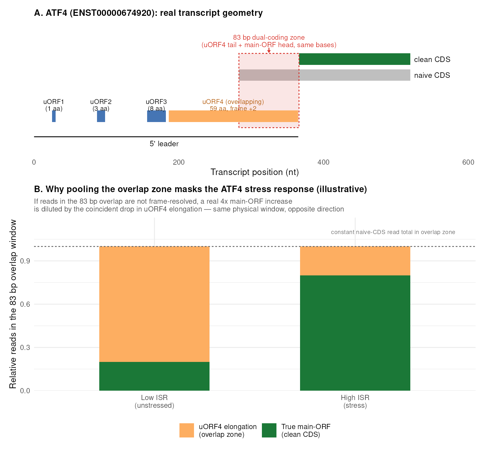

# What uORF usage tells us about downstream CDS output: groups, distance, and what is (and isn't) generic

Updated: 2026-09-24

## Purpose

This note asks a narrower, more foundational question than the story-specific
notes elsewhere in `md/`: across the ~82-gene marker panel this atlas has
built structural rules for, what can we actually deduce about how uORF
architecture shapes downstream CDS translation, in general? Specifically:
what natural groups of uORF architecture exist, does distance from a uORF to
the CDS matter the way textbook reinitiation biology says it should, what
does the published literature say, and does anything here look like a
genuinely new, generic pattern rather than a restatement of known biology.

The short answer, argued in detail below: **uORF *count*, *overlap status*,
and how densely uORFs pack the leader (and each other) are strong, robust
predictors of clean-CDS output across genes. Raw distance from the last uORF
stop to the CDS start is not** -- and the reason why is mechanistically
informative rather than a statistical artifact, as the ATF4 worked example
demonstrates concretely.

## Why "clean CDS" and not just "uORF vs CDS": the ATF4 case

Before the structural analysis, one methodological point has to be
established, because it changes which genes even *can* show a clean signal.
This atlas's `clean_cds` step does not count all reads landing in the
annotated CDS. It explicitly **removes CDS bases that a predicted
upstream/overlapping ORF also spans**, and only counts the remainder as
"clean CDS." ATF4 is close to the sharpest real example of why this matters,
using this session's own atlas output for its actual transcript
(`ENST00000674920`):

ATF4's leader carries four predicted uORFs. uORF1 (position 25-30, a 1-amino-acid
peptide) is the classical short, highly permissive uORF. uORF4 (position
186-365, ATG-initiated, 59 amino acids, frame +2 relative to the main ORF) is
the classical *overlapping* uORF: it runs directly into the main ORF's own
coding sequence, ending only 83 nt before what a naive GTF-based CDS boundary
would call the start of translation. Those 83 bases simultaneously belong to
two different reading frames -- the tail of uORF4, and the head of the real
ATF4 protein.

This is exactly the geometry behind the well-established ATF4/GCN4
delayed-reinitiation switch (Vattem & Wek 2004; Hinnebusch 2005). Under low
integrated-stress-response (ISR) activity, ribosomes that translate the
short permissive uORF re-scan and quickly reacquire the ternary complex
(eIF2-GTP-Met-tRNAi), so they reinitiate at the *inhibitory* overlapping
uORF instead of the main ORF -- main-ORF translation stays low. Under ISR
activation (eIF2-alpha phosphorylation depletes the ternary complex),
reacquisition is slow, so ribosomes scan *past* the inhibitory uORF's start
codon before they are reinitiation-competent, and only become competent by
the time they reach the real start codon -- main-ORF translation rises
sharply. This is one of the best-characterized translational switches in
molecular biology, and it is the reason ATF4 is this atlas's flagship ISR
marker.

The practical consequence for measurement: those 83 overlapping bases carry
ribosome-protected fragments from **two anti-correlated sources at once**.
Under low ISR, most footprints there come from ribosomes still elongating
through uORF4. Under high ISR, footprints there increasingly come from
ribosomes that skipped uORF4 and are now translating the real ATF4 protein
from its first codons. If a naive pipeline counted every footprint landing
in the genomic/transcript span of the annotated CDS as "CDS signal" without
first resolving which frame it belongs to, the *real* main-ORF increase
under stress would be undercounted -- diluted by the coincident *decrease*
in uORF4 elongation occupying the exact same physical window (panel B is a
labeled schematic of this masking effect, not a re-measured value; the
transcript geometry in panel A is real). The atlas's `clean_cds_bases` field
for ATF4 is 973 of the annotated 1,056 CDS bases (`excluded_cds_bases = 83`)
-- exactly this overlap, removed before any relative-usage statistic is
computed. Skipping this step would not just add noise to ATF4's signal; it
would specifically attenuate the one signal ATF4 is used for.

This matters beyond one gene: **17 of the 82 genes in this atlas's marker
panel have `has_overlapping_uorf = TRUE`**, and overlap status turns out
(next section) to be one of the two strongest predictors of clean-CDS
output in the whole panel. Any cross-gene comparison that used naive,
uncorrected CDS counts would be most wrong exactly where the biology is most
interesting.

## Natural groups in the atlas's own uORF taxonomy

The atlas's translon categorizer sorts predicted features into a small set
of structural classes, independent of any specific gene's story:

- **uORF** -- entirely within the 5' leader, does not touch the CDS.
- **uoORF** ("overlapping uORF") -- starts in the leader, extends into and
  past the annotated CDS start, in a different frame. This is the class
  that forces a clean-CDS correction (ATF4's uORF4 above).
- **NTE** (N-terminal extension) -- an upstream in-frame start that extends
  the same reading frame as the main CDS.
- **NTT** / internal / dORF / doORF / CTE -- downstream or internal
  variants, less relevant to the "uORF versus CDS" question directly.

Within just the leader-only and overlapping uORF classes, the gene
geometry table (`uorf_structure_gene_geometry.csv`) further bins genes by:

- `uorf_count_bin`: 1, 2, 3-4, 5+ predicted uORFs.
- `overlap_class`: leader-only uORFs only, vs. has at least one uoORF/CDS
  overlap.
- `spacing_class`: single uORF; 0-10, 11-30, 31-60, or >60 bp between the
  closest pair of uORFs; or "overlapping/nested uORFs" when two predicted
  uORFs themselves overlap each other.
- `last_leader_gap_class`: distance from the last leader-uORF stop to the
  (clean) CDS start, binned at <=10, 11-50, 51-150, and >150 bp.

Cross-tabulating these (`uorf_structure_sample_group_summary.csv`, sample-row
level across all runs) already shows the main pattern before any regression:
single-uORF, leader-only genes average clean-CDS relative density 0.91
(effectively "mostly clean"); genes with 5+ uORFs *and* an overlap average
0.23 (mostly redirected). The two structural axes -- **how many** and
**whether any overlaps** -- visibly do almost all of the separating work
between "clean" and "redirected" genes, well before distance enters the
picture at all.

## What actually predicts clean-CDS output, ranked by real effect size

Univariate regressions of clean-CDS relative usage (logit scale) against
each structural feature across the 82 modeled genes
(`uorf_structure_univariate_rule_effects.csv`), ranked by statistical
strength (Benjamini-Hochberg q-value) and by explained variance:

| Predictor | q-value | R-squared | Effect across IQR (percentage points) |
|---|---|---|---|
| uORF fraction of leader occupied | 7.5e-15 | **0.565** | -62.3 |
| Longest uORF length | 7.8e-8 | 0.342 | -19.0 |
| Number of uORFs (any) | 4.3e-7 | 0.307 | -14.0 |
| Number of uORF pairs <=30 bp apart | 1.1e-6 | 0.285 | -19.2 |
| Number of uORF pairs <=10 bp apart | 1.4e-6 | 0.278 | -18.1 |
| Number of leader-only uORFs | 1.1e-5 | 0.231 | -18.2 |
| First uORF length | 6.0e-6 | 0.248 | -17.8 |
| Has an overlapping uoORF (binary) | 2.5e-5 | 0.214 | **-72.3** |
| Number of overlapping uoORFs | 9.3e-5 | 0.187 | -41.0 |
| Number of overlapping/nested pairs | 8.3e-6 | 0.240 | -7.5 |
| Max CDS-overlap fraction | 8.7e-3 | 0.092 | -27.9 |
| Min inter-uORF gap (30 bp units) | 1.2e-3 | 0.232 | **+12.8** (n=46) |
| **Leader uORFs ending <=100 bp before CDS** | 0.196 | 0.024 | -11.1 (n.s.) |
| **Leader uORFs ending <=30 bp before CDS** | 0.342 | 0.012 | -6.5 (n.s.) |
| **First-uORF-stop-to-CDS gap** | 0.146 | 0.033 | n.s. |
| **Min leader-stop-to-clean-CDS gap** | 0.146 | 0.033 | n.s. |
| **Min start-to-start spacing** | 0.249 | 0.034 | n.s. |

The pattern is consistent and clear. Every feature that describes **how much
of the leader is occupied, how many uORFs there are, whether any overlaps
the CDS, and how close the uORFs sit to *each other*** is a strong,
significant predictor. Every feature that describes **distance from a uORF
to the CDS specifically** is not significant in this panel, with one
partial exception (`min_inter_uorf_gap`, discussed below, which is really
still an inter-uORF spacing measure, not a uORF-to-CDS distance measure).

Multivariable models confirm this is not just univariate confounding.
Adding `last_leader_stop_to_clean_cds_gap` to a model that already has
`n_uorfs` and `has_overlapping_uorf` improves R-squared only marginally
(0.377 vs 0.360) and the gap term itself stays non-significant (p=0.167,
`uorf_structure_multivariable_coefficients.csv`). A random-forest importance
ranking across gene x branch rows tells the same story from a different,
nonlinear angle: `min_inter_uorf_gap` (uORF-to-uORF spacing) is the single
strongest numeric predictor after the categorical branch/state labels
(%IncMSE = 42.3), while `last_leader_stop_to_clean_cds_gap` (uORF-to-CDS
distance) ranks lower (29.9) and behind `uorf_union_fraction_of_leader`,
`longest_uorf_bases`, and `n_uorfs`.

## Why distance-to-CDS specifically fails as a cross-gene rule

This is not a modeling artifact, and the atlas's own auto-generated rule
interpretation table already states the mechanistic reason directly: *"A
larger gap after the last leader uORF is not a strong simple rescue rule in
this small panel; ATF4/MYC violate simple distance logic because
overlapping uoORFs reset the clean-CDS coordinate."*

That is exactly what the ATF4 figure above shows structurally. The moment a
gene has an overlapping uoORF, the reference point that "distance to CDS"
is measured from stops being the naive, annotation-level CDS start and
becomes the *clean* CDS start -- which is, by construction, wherever the
overlap ends. A raw uORF-to-CDS distance computed against the wrong
reference point is not just noisy, it is measuring a different quantity for
overlap-class genes than for leader-only-class genes. Any analysis that
pools both classes and asks "does distance to CDS predict output" is
implicitly asking two different, incompatible questions at once, and this
alone is enough to erase a real distance effect if one exists within each
class separately. This atlas's marker panel does not yet have enough
overlap-class genes (17 of 82) to refit distance effects separately within
each class with real power, but the direction of the confound is clear and
worth stating as a specific, checkable prediction for a future, larger
panel: **distance-to-CDS should be tested only within the leader-only-uORF
class, against the honestly-computed clean-CDS start** in
overlap-class genes.

## What the published literature says

Four points of established biology are directly relevant, and none of them
are contradicted here -- they are refined by knowing which axis they apply
to.

**uORF count, length, and Kozak strength are established repressors.**
Genome-wide surveys (Calvo, Pagliarini & Mootha, *PNAS* 2009) first linked
uORF presence to reduced and more variable protein output relative to mRNA
level. Massively parallel reporter assays across thousands of synthetic
uORF variants (Johnstone, Bazzini & Giraldez, *EMBO J* 2016) later showed
quantitatively that uORFs are repressive on average, that repression
strength scales with the uORF's own Kozak context (a stronger uORF start
codon diverts *more* scanning ribosomes away from the main ORF, not fewer),
and -- most relevant here -- that **overlapping uORFs are a distinct and
substantially more repressive class than non-overlapping ones**, matching
this atlas's own largest single-feature effect (`has_overlapping_uorf`,
-72.3 points, the strongest binary predictor found here).

**Distance-dependent reinitiation is real, but it is a within-gene, tuned
mechanism, not a generic cross-gene lever.** The classical work this
depends on (Kozak 1987; the GCN4/ATF4 delayed-reinitiation dissections by
Hinnebusch and Wek's groups) established that reinitiation efficiency
recovers as a function of the distance a 40S subunit has to rescan before
reaching the next start codon, because the ribosome needs time to
reacquire the ternary complex. Grant & Hinnebusch's classical GCN4
mutagenesis showed this recovery is closely tuned by the *exact* spacing
between GCN4's four uORFs -- a handful of nucleotides can flip the switch's
behavior. That is a real, mechanistically load-bearing distance effect. But
it was discovered and quantified *within one gene*, by systematically
varying that gene's own spacing in a controlled reporter. This atlas is
instead asking whether distance varies *predictively across many different
endogenous genes*, each already carrying whatever spacing evolution
happened to leave it with. Those are different questions, and the reason
they give different answers is straightforward: reinitiation recovery
plateaus by roughly 50-100 nt in most systems that have measured it,
and the median last-leader-uORF-to-clean-CDS gap in this atlas's own panel
is 45 bp (`predictor_q25`-`predictor_q75` spans 21-95 bp) -- meaning most
real endogenous genes already sit at or past the point where additional
distance stops helping. A cross-gene regression cannot detect a saturating
effect once most of the observations are already past the saturation
point; it can only detect it in a system built to sit *near* the threshold,
like GCN4/ATF4 itself.

**Inter-uORF spacing, not uORF-to-CDS spacing, is the more genuinely
informative distance axis in real genes.** This is the one distance-like
feature that *did* come out significant here
(`min_inter_uorf_gap`, q=1.2e-3, and the top numeric random-forest
feature), and it has a clean mechanistic reading that is *also* consistent
with reinitiation biology: a ribosome terminating at one uORF and finding
the next uORF's start codon very close by has the same "not enough time to
reacquire the ternary complex" problem as terminating close to the CDS --
except here it determines whether the ribosome initiates at the *next
uORF* rather than continuing to scan toward the real start codon. Tightly
packed uORFs therefore behave like a cascade of local distance effects, each
one determining whether the ribosome gets diverted again versus continues
scanning -- and this compounds naturally with `uorf_union_fraction_of_leader`,
this atlas's single strongest predictor overall (R-squared = 0.565): a leader
that is densely packed with close-spaced uORFs is simultaneously
high-occupancy and low-inter-uORF-gap, and either framing captures much of
the same underlying "how crowded is the leader" biology.

## Is there a generic, novel pattern here?

Yes, and it is stated precisely to avoid overclaiming: **across a diverse
panel of real endogenous human genes, cross-gene variation in clean-CDS
output is explained almost entirely by uORF *architecture density* --
count, overlap status, leader-occupancy fraction, and how close uORFs sit
to each other -- and essentially not at all by raw distance from the last
uORF to the CDS start, once that architecture is accounted for.** This does
not contradict the classical reinitiation-distance literature; it refines
where that literature's finding applies. Distance-to-CDS is a real,
mechanistically necessary variable *within* a single evolutionarily-tuned
switch (GCN4/ATF4-like genes, which sit deliberately near the reinitiation
threshold so that stress can flip them), but it is not a variable that
differs enough, or is measured from a consistent enough reference point,
across the broader gene population to show up as a cross-gene predictor.
The generic, transferable lever is architecture density; distance is a
gene-specific fine-tuning parameter layered on top of it, most visible in
the small number of genes -- like ATF4 -- that a naive analysis would
already get wrong for an unrelated reason (the coordinate-reset problem
above) if the clean-CDS correction were skipped.

## Limitations, stated plainly

This analysis covers 82 genes with atlas-modeled uORF structure -- a
curated, ISR/interferon/hypoxia/EMT/senescence/OXPHOS/proliferation marker
panel selected for the atlas's existing dominant-state work, not a
genome-wide uORF survey. The `n=20`-gene caveat attached to some of the
atlas's own rule-interpretation rows applies more narrowly to specific
sub-questions (the false-negative-uoORF and short-spacing rules); the
headline univariate/multivariable numbers above use the full 82-gene panel
where noted. All of this is correlational, cross-sectional, endogenous-gene
data -- exactly the complement to, not a replacement for, the controlled
reporter assays (Johnstone et al., Grant & Hinnebusch, Sample et al.) that
established the underlying mechanisms in the first place. And the specific
distance-within-class prediction above (test distance separately in
leader-only vs. overlap-class genes) is a prediction to go test with a
larger panel, not a result already shown here.

## Concrete next steps

1. Extend the marker panel with the lab's improved translon predictor
   (already in development per `dominant_cell_state_scientific_note.md`) so
   the overlap-class subgroup (currently 17 genes) is large enough to
   refit distance effects separately within it.
2. Recompute `last_leader_stop_to_clean_cds_gap`-style distance features
   using the *clean* CDS start uniformly (already implicitly true for
   overlap-class genes here, since `clean_cds_bases` already reflects it,
   but worth stating as an explicit invariant when the feature table is
   extended) so overlap- and leader-only-class genes are being asked the
   same question.
3. Test the inter-uORF-gap-cascade model directly: does clean-CDS output
   depend on the *minimum* inter-uORF gap alone, or on the number of
   sub-threshold gaps (i.e., a count of "risky" transitions), which the
   current single-minimum-gap feature cannot distinguish?
4. Once available, bring in the p-shift denoising model and revisit
   overlapping/internal-ORF frame assignment specifically for the 17
   overlap-class genes, since frame-resolved read assignment in exactly
   this class is the hardest measurement problem this note has surfaced.
